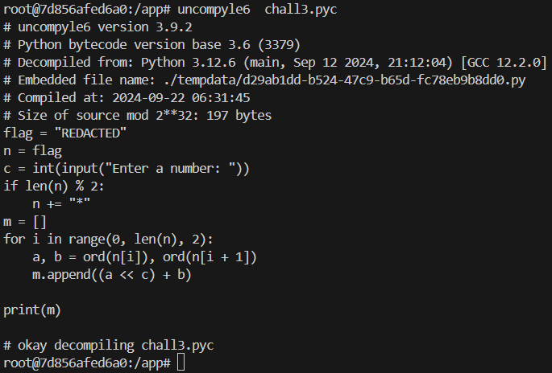

# Bitwise Mystery

## Challenge Description

This challenge obscures the flag using a combination of bit shifts and character manipulation. Discover how the paired characters are transformed and recover the hidden message!

Author : **PattuSai**

[ chall3.pyc](https://ctf.h7tex.com/files/f906c2734340c6d64d9272e928c3577e/chall3.pyc?token=eyJ1c2VyX2lkIjoxMzU4LCJ0ZWFtX2lkIjo2NDQsImZpbGVfaWQiOjMyfQ.ZvjZJg.SbynMgp-tCce6XJM1fWmkt854tA)[ out3.txt](https://ctf.h7tex.com/files/2e1d5192a99a6e7155f4e588184e09d0/out3.txt?token=eyJ1c2VyX2lkIjoxMzU4LCJ0ZWFtX2lkIjo2NDQsImZpbGVfaWQiOjMzfQ.ZvjZJg.LYYQzBtkAY6PbfgSzhtt-mygvXs)

***

## Solution

<figure><figcaption></figcaption></figure>

```bash
pip3 install uncompyle6
uncompyle6 chall3.pyc
```


<figure><figcaption></figcaption></figure>

```bash
uncompyle6  chall3.pyc > chall3.py
```


```python
# uncompyle6 version 3.9.2
# Python bytecode version base 3.6 (3379)
# Decompiled from: Python 3.12.6 (main, Sep 12 2024, 21:12:04) [GCC 12.2.0]
# Embedded file name: ./tempdata/d29ab1dd-b524-47c9-b65d-fc78eb9b8dd0.py
# Compiled at: 2024-09-22 06:31:45
# Size of source mod 2**32: 197 bytes
flag = "REDACTED"
n = flag
c = int(input("Enter a number: "))
if len(n) % 2:
    n += "*"
m = []
for i in range(0, len(n), 2):
    a, b = ord(n[i]), ord(n[i + 1])
    m.append((a << c) + b)

print(m)

# okay decompiling chall3.pyc

```


```python
def finding_c(value):
    for c in range(0, 1000):
        a, b = ord("H"), ord("7")
    
        if (a << c) + b == value:
            return c


if __name__ == "__main__":
    # Got from the out3.txt file
    encrypted_text = [
                        322523242873603806320271688401855976049516951601789533025598430538786029449943176134846359031111424671799, 
                        300125795451825764214697265596171533268300496629443037676598539529148110738141566681037584098395353514068, 
                        313564263904892589478041919279582198937030369612850934885998474134930861965222532353322849058024996208763, 
                        232933453186491637897973997179118204924651131712403551629598866500234354602736738319611259300247140040806, 
                        223974474217780421055744228056844427812164549723464953489998910096379187118016094538087749327160711577697, 
                        215015495249069204213514458934570650699677967734526355350398953692524019633295450756564239354074283114550, 
                        443469458951205233690373571552551967068085808452460607910197841990830790493671867185413743667778208923745, 
                        215015495249069204213514458934570650699677967734526355350398953692524019633295450756564239354074283114595, 
                        219494984733424812634629343495707539255921258728995654420198931894451603375655772647325994340617497346149, 
                        246371921639558463161318650862528870593381004695811448838998801106017105829817703991896524259876782735457, 
                        237412942670847246319088881740255093480894422706872850699398844702161938345097060210373014286790354272312, 
                        232933453186491637897973997179118204924651131712403551629598866500234354602736738319611259300247140040806, 
                        246371921639558463161318650862528870593381004695811448838998801106017105829817703991896524259876782735458, 
                        241892432155202854740203766301391982037137713701342149769198822904089522087457382101134769273333568503908, 
                        456907927404272058953718225235962632736815681435868505119597776596613541720752832857699008627407851618352, 
                        215015495249069204213514458934570650699677967734526355350398953692524019633295450756564239354074283114550, 
                        250851411123914071582433535423665759149624295690280747908798779307944689572178025882658279246419996966964, 
                        438989969466849625269258686991415078511842517457991308840397863788903206751311545294651988681234994692194, 
                        255330900608269680003548419984802647705867586684750046978598757509872273314538347773420034232963211198513, 
                        559936185544451052639360570142111069530411374308662383724997275240947967795040236345219373317901778944042
                    ]

    c = finding_c(encrypted_text[0])

    for each in encrypted_text:
        a = each >> c
        b = each - (a << c)

        print(f"{chr(a)}{chr(b)}", end="")

    print()
```


<figure><figcaption></figcaption></figure>
